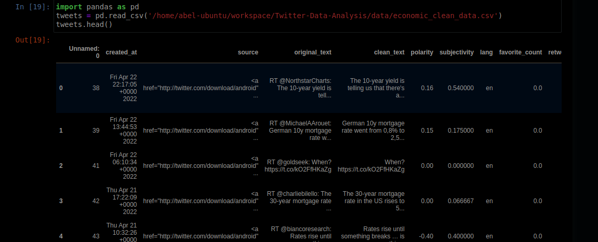
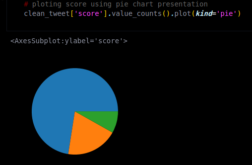
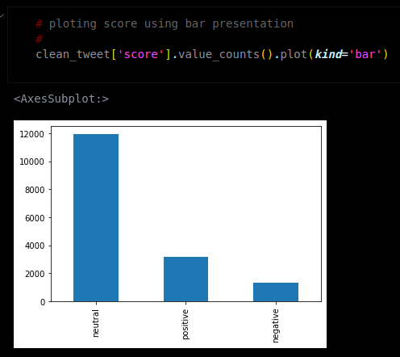
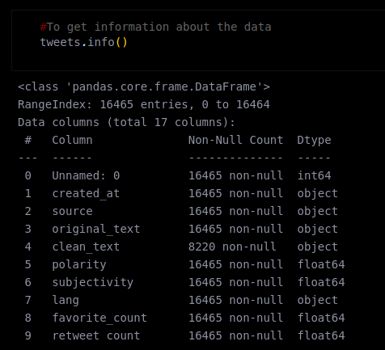
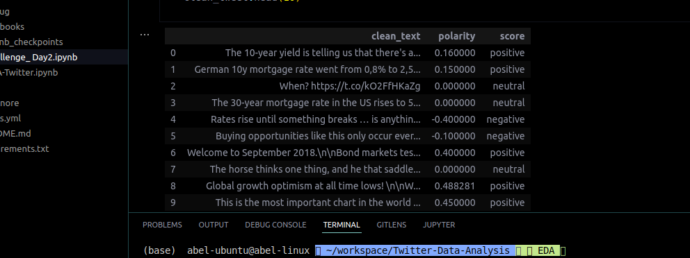
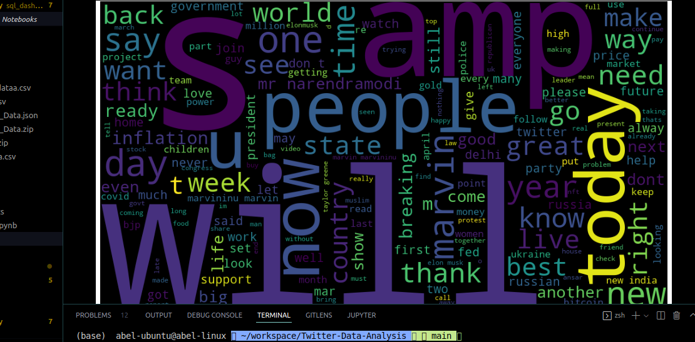
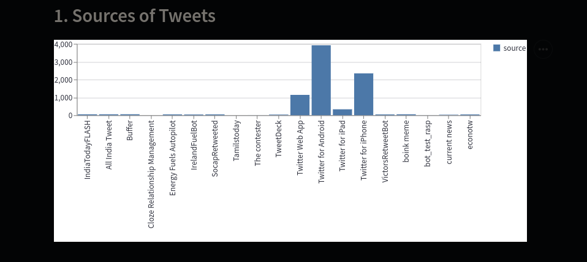
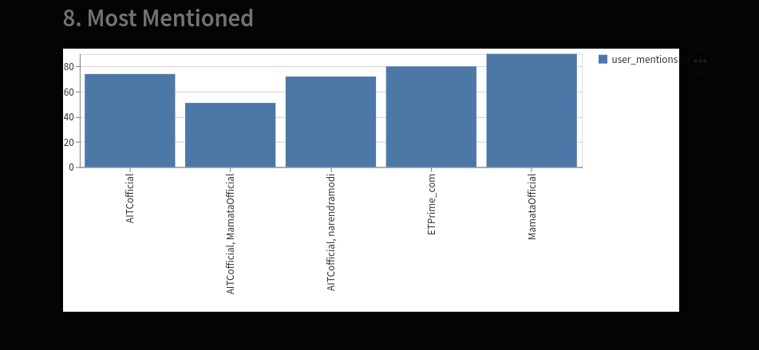

**Streamlit Data app:** [Tweet Live Visualization](https://share.streamlit.io/abel-blue/twitter-data-analysis/main/streamlit/app.py)

Articles: [Linkedin Article](https://www.linkedin.com/pulse/twitter-data-mining-nutshell-abel-mitiku/?trackingId=WGy4deloToe0PC0iE%2BqH4Q%3D%3D), 
[Medium Article](https://medium.com/@Abel-Blue/twitter-data-mining-in-a-nutshell-452e5e7a697d)

---

# Twitter-Data-Analysis

<!--  -->
<!--  -->

## What Is Twitter Data?

Twitter data is the information collected by either the user, the access point, what’s in the post and how users view or use your post. While this might sound somewhat vague, it’s largely due to the massive amount of data that can be collected from a single Tweet.

With this information, you can know demographics, total clicks on your profile or how many people saw your Tweet. This is just the tip of the iceberg, but understanding the data allows you to know how it’s used and the patterns of your content.

## How the data is collected?

Twitter is the Major Source of data for our challenge. We were provided with pre-downloaded data on Economic hardships-related topics. The data comes in two parts.

*1.* The first will be around 100MB of a raw twitter data dump in JSON format. This data is collected using the following keywords: [‘inflation’, ‘fuelprice’, ‘fuelpricehike’, ‘ fuelprices’, ‘fuelshortage’, ‘foodprice’, ‘oilprice’, ‘oilprices’, ‘cookingoilprice’, ‘unemployment’, ‘unemploymentrate’, ‘economiccrisis’, ‘economichardship’]

*2.* The second one will be around 300MB of the same format, but collected based on the original keyword plus country-specific geocodes included e.g. ‘0.0263,37.9062,530km for Kenya’. 

## Extracting tweets from Twitter raw JSON file

To load the data from JSON format we need to install the required libraries. We will have to load the Twitter data into a pandas data frame using different types of python functions like **find_status_count()**, **find_hashtags()**, and **find_retweeted_text()**. Using this many functions, we need to append every tweet into a list and at the end, we will get the extracted data in the form of a CSV file.

## Data preparation and cleaning

When working with multiple data sources, there are many chances for data to be incorrect, duplicated, or mislabeled. If data is wrong, outcomes and algorithms are unreliable, even though they may look correct. Data cleaning is the process of changing or eliminating garbage, incorrect, duplicate, corrupted, or incomplete data in a dataset.

In this project, we managed to clean any duplicate or incomplete or convert polarity and subjectivity into numeric values or remove non-English tweets from the data set that we extracted in the data extraction phase. Below is a snapshot of the end result.

Using this processed and clean tweet we determined to write a function of a score map of their sentiments by categorizing them using 'positive', 'negative', or 'neutral' marks and visualizing the 𝐬𝐜𝐨𝐫𝐞 column using a piechart and bar chart.

## Exploratory Data Analysis (EDA)

In data mining, Exploratory Data Analysis (EDA) is an approach to analyzing datasets to summarize their main characteristics, often with visual methods. EDA is used for seeing what the data can tell us before the modeling task.

## Sentiment Analysis

Sentiment analysis can be defined as a process that automates the mining of attitudes, opinions, views, and emotions from text, speech, tweets, and database sources through Natural Language Processing (NLP). Sentiment analysis involves classifying opinions in text into categories like "positive", "negative" or "neutral".
In this project, we were looking for the hardship that is caused by financial or economical issues.

## Topic Modeling and Topic Classification

Topic modeling is an unsupervised machine learning technique that’s capable of scanning a set of documents, detecting word and phrase patterns within them, and automatically clustering word groups and similar expressions that best characterize a set of documents. e.g. word cloud
Word clouds (also known as text clouds or tag clouds) work in a simple way: the more a specific word appears in a source of textual data (such as a speech, blog post, or database), the bigger and bolder it appears in the word cloud.

## Building a dashboard visualization with streamlit

A data visualization dashboard allows digital marketers or researchers to track multiple data sources and visualize the data, ensuring a solid data set for decision-makers.
**Streamlit Data app:** [Tweet Live Visualization](https://share.streamlit.io/abel-blue/twitter-data-analysis/main/streamlit/app.py)

---

Articles: [Linkedin Article](https://www.linkedin.com/pulse/twitter-data-mining-nutshell-abel-mitiku/?trackingId=WGy4deloToe0PC0iE%2BqH4Q%3D%3D), 
[Medium Article](https://medium.com/@Abel-Blue/twitter-data-mining-in-a-nutshell-452e5e7a697d)
